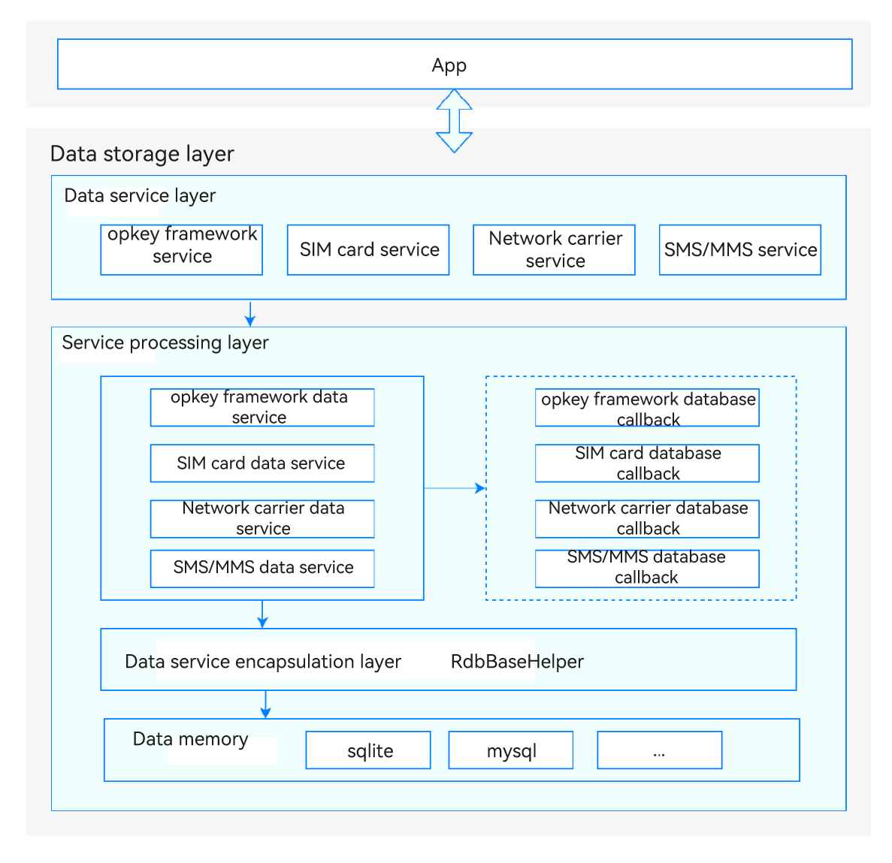

# Data Storage<a name="EN-US_TOPIC_0000001152064139"></a>

-   [Introduction](#section117mcpsimp)
-   [Directory Structure](#section124mcpsimp)
-   [Constraints](#section128mcpsimp)
-   [Usage](#section134mcpsimp)
    -   [Available APIs](#section136mcpsimp)
    -   [Permissions]( #section137mcpsimp)

-   [Usage Guidelines](#section163mcpsimp)
    -   [Parameters of the Insert API](#section1099113151207)
    -   [Parameters of the Delete API](#section1098113151208)
    -   [Parameters of the Update API](#section1099113151207)
    -   [Parameters of the Query API](#section1096113151208)
    -   [Sample Code](#section1558565082915)
    
-   [Repositories Involved](#section206mcpsimp)

## Introduction<a name="section117mcpsimp"></a>

The data storage module stores persistent data of key modules of the Telephony subsystem, such as the SIM cards and SMS modules, and provides the **DataAbility** API for data access.

**Figure 1** Architecture of the data storage module<a name="fig13267152558"></a> 



## Directory Structure<a name="section124mcpsimp"></a> 

```
/base/telephony/data_storage     # Data storage
├─ BUILD.gn                         # Build script (gn)
├─ README.md                        # Readme
├─ common                           # Public and common files
│  ├─ include                       
│  └─ src                           
├─ pdp_profile                      # Network carrier
│  ├─ include                       
│  └─ src                           
├─ sim                              # SIM card
│  ├─ include                       
│  └─ src                           
├─ sms_mms                          # SMS/MMS
│  ├─ include                      
│  └─ src                           
├─ ohos.build                       # Build code
└─ test                             # Test code
```

## Constraints<a name="section128mcpsimp"></a>

- Programming language: C++

- Software constraints: This module must work with the Utils and Application Framework subsystems.

- Hardware constraints: none

- Use case: When a user needs to edit the persistent data stored in Telephony subsystem modules, such as the SIM card and SMS/MMS modules, your application can call the **Insert**, **Delete**, **Update**, and **Query** APIs provided by **DataAbilityHelper** as demanded.

  You need to declare the corresponding permission for access to the specified URI.

## Usage<a name="section134mcpsimp"></a>

### Available APIs<a name="section136mcpsimp"></a>

**Table 1** APIs provided by DataAbilityHelper

<a name="table165976561598"></a>

| API Definition                                                    | **Description**|
| ------------------------------------------------------------ | ------------ |
| int Insert(const Uri &uri, const NativeRdb::ValuesBucket &value) | Inserts data.     &nbsp;&nbsp;&nbsp;&nbsp;&nbsp;|
| int Delete(const Uri &uri, const NativeRdb::DataAbilityPredicates &predicates) | Deletes data.     &nbsp;&nbsp;&nbsp;&nbsp;&nbsp;|
| int Update( const Uri &uri, const NativeRdb::ValuesBucket &value, const NativeRdb::DataAbilityPredicates &predicates) | Updates data.     &nbsp;&nbsp;&nbsp;&nbsp;&nbsp;|
| std::shared_ptr\<NativeRdb::AbsSharedResultSet\> Query( const Uri &uri, const std::vector\<std::string\> &columns, const NativeRdb::DataAbilityPredicates &predicates) | Queries data.     &nbsp;&nbsp;&nbsp;&nbsp;&nbsp;|

**Table 2** Required permissions

<a name="table165976561598"></a>

| Module          | **Required Permission**                                                |
| -------------- | ------------------------------------------------------------ |
| SMS/MMS module    | com.ohos.smsmmsability.DataAbilityShellProvider.PROVIDER     |
| SIM card module     | com.ohos.simability.DataAbilityShellProvider.PROVIDER        |
| Network carrier module| com.ohos.pdpprofileability.DataAbilityShellProvider.PROVIDER |

## Usage Guidelines<a name="section163mcpsimp"></a>

### Parameters of the Insert API<a name="section1099113151207"></a>

**Table 3** Parameters of the Insert API

<a name="table1234838197"></a>

| Parameter | **Description**                             |
| ----- | ------------------------------------- |
| uri   | Resource path.                             |
| value | Data set. This field corresponds to the table structure field on which the current operation is performed.|

### Parameters of the Delete API<a name="section1098113151208"></a>

**Table 4** Parameters of the Delete API

<a name="table1234838197"></a>

| Parameter      | Description                                 |
| ---------- | ------------------------------------- |
| uri        | Resource path.                             |
| value      | Data set. This field corresponds to the table structure field on which the current operation is performed.|
| predicates | Conditions for data deletion.                             |

### Parameters of the Update API<a name="section1097113151210"></a>

**Table 5** Parameters of the Update API

<a name="table1234838197"></a>

| Parameter      | Description    |
| ---------- | -------- |
| uri        | Resource path.|
| predicates | Conditions for data updating.|

### Parameters of the Query API<a name="section1096113151208"></a>

**Table 6** Parameters of the Query API

<a name="table1234838197"></a>

| Parameter      | Description          |
| ---------- | -------------- |
| uri        | Resource path.      |
| columns    | Fields in the query result.|
| predicates | Conditions for data query.      |

### Sample Code<a name="section1558565082915"></a>

The following provides the procedure and sample code for you to query, insert, delete, or update SMS/MMS data:

1. Call **SystemAbilityManagerClient** to obtain a **SystemAbilityManager** object.
2. Call **saManager** to obtain an **IRemoteObject** object based on the specified service ID.
3. Call **IRemoteObject** to create a **DataAbilityHelper** object.
4. Call **DataAbilityHelper::Query** to query data, and call the other related APIs to process data. 

   Sample code for creating a **DataAbilityHelper** instance:
   ```
   std::shared_ptr<AppExecFwk::DataAbilityHelper> CreateDataAHelper(int32_t systemAbilityId)
   {
       // Obtain a SystemAbilityManager instance through SystemAbilityManagerClient.
       auto saManager = SystemAbilityManagerClient::GetInstance().GetSystemAbilityManager();
       if (saManager == nullptr) {
           DATA_STORAGE_LOGE("DataSimRdbHelper Get system ability mgr failed.");
           return nullptr;
       }
       // Obtain an IRemoteObject.
       auto remoteObj = saManager->GetSystemAbility(systemAbilityId);
       while (remoteObj == nullptr) {
           DATA_STORAGE_LOGE("DataSimRdbHelper GetSystemAbility Service Failed.");
           return nullptr;
       }
       // Create a DataAbilityHelper instance.
       return AppExecFwk::DataAbilityHelper::Creator(remoteObj);
   }
   ```
   Sample code for querying SMS/MMS messages:
   ```
   std::shared_ptr<NativeRdb::AbsSharedResultSet> SmsSelect(std::shared_ptr<AppExecFwk::DataAbilityHelper> helper)
   {	
       // Resource path
       Uri uri("dataability:///com.ohos.smsmmsability/sms_mms/sms_mms_info");
       // Fields in the query result
       std::vector<std::string> colume;
       // Phone number of the message sender
       colume.push_back("sender_number");
       // Message title
       colume.push_back("msg_title");
       // Message content
       colume.push_back("msg_content");
       // Query predicates
       NativeRdb::DataAbilityPredicates predicates;
       // Call the DataAbilityHelper::Query API to query data.
       return helper->Query(uri, colume, predicates);
   }
   ```
   Sample code for inserting SMS/MMS messages:
   ```
   int SmsInsert(std::shared_ptr<AppExecFwk::DataAbilityHelper> helper)
   {
       Uri uri("dataability:///com.ohos.smsmmsability/sms_mms/sms_mms_info");
       NativeRdb::ValuesBucket value;
       // Phone number of the message recipient
       value.PutString(SmsMmsInfo::RECEIVER_NUMBER, "138XXXXXXXX");
       // Message content
       value.PutString(SmsMmsInfo::MSG_CONTENT, "ceshi");
       value.PutInt(SmsMmsInfo::GROUP_ID, 1);
       return helper->Insert(uri, value);
   }
   ```
   Sample code for deleting SMS/MMS messages:
   ```
    int SmsDelete(std::shared_ptr<AppExecFwk::DataAbilityHelper> helper)
    {
        Uri uri("dataability:///com.ohos.smsmmsability/sms_mms/sms_mms_info");
        NativeRdb::DataAbilityPredicates predicates;
        // Delete the message whose MSG_ID is 1.
        predicates.EqualTo(SmsMmsInfo::MSG_ID, "1");
        return helper->Delete(uri, predicates);
    }
   ```
   Sample code for updating SMS/MMS messages:
   ```
   int SmsUpdate(std::shared_ptr<AppExecFwk::DataAbilityHelper> helper)
   {
       Uri uri("dataability:///com.ohos.smsmmsability/sms_mms/sms_mms_info");
       NativeRdb::ValuesBucket values;
       // Message content
       values.PutString(SmsMmsInfo::MSG_CONTENT, "hi ohos");
       NativeRdb::DataAbilityPredicates predicates;
       // Message ID
       predicates.EqualTo(SmsMmsInfo::MSG_ID, "1");
       return helper->Update(uri, values, predicates);
   }
   ```


## Repositories Involved<a name="section206mcpsimp"></a>

[Telephony Subsystem](https://gitee.com/openharmony/docs/blob/master/en/readme/%E7%94%B5%E8%AF%9D%E6%9C%8D%E5%8A%A1%E5%AD%90%E7%B3%BB%E7%BB%9F.md)

**telephony_data_storage**

[telephony_core_service](https://gitee.com/openharmony/telephony_core_service/blob/master/README.md)

[telephony_sms_mms](https://gitee.com/openharmony/telephony_sms_mms/blob/master/README.md)

[telephony_cellular_call](https://gitee.com/openharmony/telephony_cellular_call/blob/master/README.md)

[telephony_call_manager](https://gitee.com/openharmony/telephony_call_manager/blob/master/README.md)
